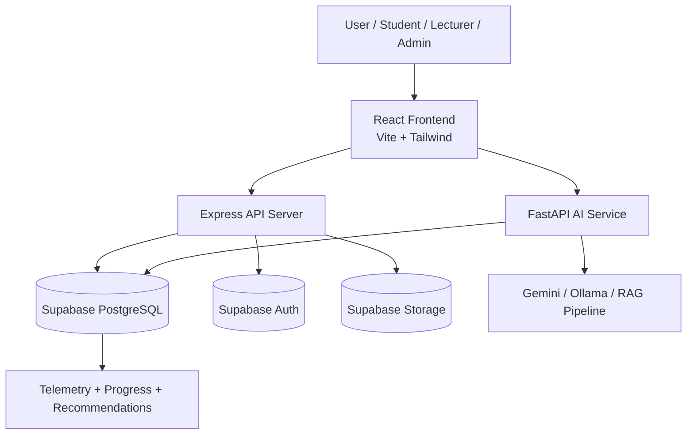

# System Architecture

## 1. Overview

This project is a multi-service adaptive learning platform composed of:

- a React + TypeScript frontend for learners, lecturers, and admins
- an Express.js backend for application APIs and business logic
- a FastAPI Python service for AI-powered recommendations and quiz generation
- Supabase as the primary data, authentication, and real-time backend

The architecture is designed to separate user experience, business logic, and AI intelligence while keeping the system easy to evolve.

---

## 2. High-Level Architecture

---

## 3. Components

### 3.1 Frontend Layer

Location: client/

Responsibilities:

- renders the learning experience UI
- manages authenticated user sessions
- displays progress, recommendations, quizzes, and telemetry dashboards
- communicates with backend APIs

Technologies:

- React
- TypeScript
- Vite
- Tailwind CSS
- shadcn/ui

### 3.2 API Layer

Location: server/

Responsibilities:

- handles course-related operations
- manages progress and quiz submission flows
- captures telemetry and interaction events
- performs authentication-related API routing
- acts as the main integration point for the frontend

Key modules:

- auth routes
- progress routes
- quiz routes
- course progress routes
- telemetry routes
- recommendation routes

### 3.3 AI Layer

Location: ai-service/

Responsibilities:

- generates personalized recommendations
- supports RAG-based retrieval and ranking
- creates adaptive quiz content
- analyzes progress and content relevance

Key services:

- recommendation engine
- RAG engine
- Gemini integration
- Ollama integration

### 3.4 Data Layer

Location: supabase/

Responsibilities:

- stores users, courses, materials, progress, quizzes, and telemetry
- provides authentication and row-level security
- supports structured querying for recommendations and analytics

Core data concepts:

- users
- courses
- materials
- user progress
- quiz attempts
- telemetry events
- recommendations

---

## 4. Request Flow

### User Login and Learning Experience

1. The user opens the frontend.
2. The frontend authenticates via Supabase Auth.
3. The frontend calls the Express API for course and progress data.
4. The API reads or writes records in Supabase.

### Recommendation Flow

1. The frontend requests recommendations for a user.
2. The Express backend forwards the request to the AI service.
3. The AI service reads user interaction and progress data from Supabase.
4. The AI service returns ranked recommendations.
5. The frontend renders the recommended content.

### Quiz Generation Flow

1. The frontend requests quiz generation for a course.
2. The backend or AI service builds quiz content based on course context.
3. The AI service uses Gemini/Ollama or a fallback question set.
4. The generated quiz is returned to the frontend.

---

## 5. Deployment Shape

### Development

- frontend: Vite dev server
- backend: Node/Express server
- AI service: FastAPI server
- database: Supabase cloud

### Production recommendation

A production deployment should split the services into independently deployable units:

- frontend hosted on Vercel or a static hosting platform
- backend API hosted on Railway, Render, or Azure App Service
- AI service hosted as a containerized FastAPI service
- Supabase remains the managed database/auth layer
- environment variables managed securely via secrets storage

---

## 6. Security and Reliability Considerations

- use Supabase Row Level Security for user-scoped data access
- keep service role secrets in environment variables only
- validate API requests on the backend before forwarding to AI services
- add logging and monitoring for API and AI service failures
- isolate AI workloads from core transactional services where possible

---

## 7. Summary

The current architecture follows a modular, service-oriented design:

- frontend handles presentation
- backend handles application workflows
- AI service handles intelligent recommendations and content generation
- Supabase provides durable data storage and identity

This separation makes the platform easier to scale, test, and evolve as new learning features are added.
