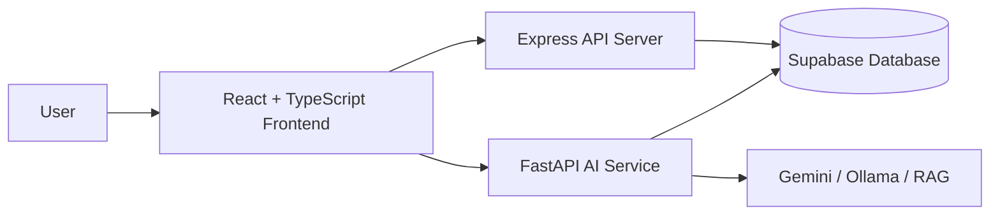

# AI Learning Recommendation Engine - Adaptive Learning Platform

## 🚀 Quick Start

1. **Prerequisites** (below)
2. `git clone <repo> && cd dataflow-ai-main 2`
3. `npm ci`
4. Setup `.env` & Supabase (below)
5. `npm run dev`

## 📋 Prerequisites

- Node.js ≥18, npm ≥10
- Python ≥3.10
- Git
- [Supabase project](https://supabase.com) (free tier)

## 🛠️ Installation

```bash
npm ci  # JS deps (root/client/server)

# Python AI service
python -m venv .venv
source .venv/bin/activate  # Windows: .venv\\Scripts\\activate
pip install -r ai-service/requirements.txt

# Unified:
npm run install:all
```

## ▶️ Run

```bash
npm run dev
```

- Client: http://localhost:5173
- Server: http://localhost:5000
- AI: http://localhost:8001

## 🏗️ System Architecture



## 🔧 Environment Variables

Create `.env`:

```
SUPABASE_URL=https://your-project.supabase.co
SUPABASE_SERVICE_ROLE_KEY=your_service_role_key
```

Copy to `server/.env`, `ai-service/.env`.

Client uses anon key in code.

Server: Add `PORT=5000` opt.

## 🗄️ Supabase Setup

1. Dashboard → SQL Editor
2. Paste & run `client/supabase/migrations/reset_and_init.sql`

Creates: courses, quizzes, progress, telemetry, AI tables.
RPC: `get_daily_engagement`.

## 🧪 Smoke Tests

- AI: `cd ai-service && python smoke_app.py`
- DB: `cd server && node scripts/smokeSupabase.js`

## Manual Runs (if needed)

**Client:** `cd client && npm run dev`
**Server:** `cd server && npm run dev`
**AI:** `source .venv/bin/activate && cd ai-service && uvicorn main:app --reload --host 0.0.0.0 --port 8001`

**Key APIs:** `/api/telemetry`, `/api/interactions`, `/api/recommendations/:user_id`
